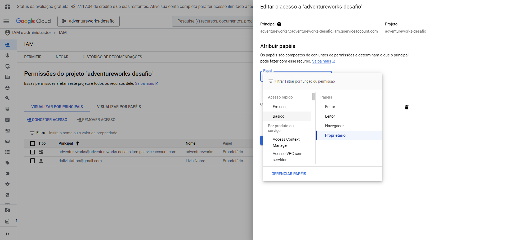

**Conexão DW(Big Query)  com dbt cloud**
*Requisitos*
- Conta GCP
- Projeto Criado no Google Cloud
- Habilite a API do BigQuery caso ainda não tenha feito isso.

- Configurar uma Conta de Serviço no Google Cloud

    - No Google Cloud Console, vá para o menu IAM & Admin e clique em Service Accounts.
    - Crie uma nova conta de serviço, fornecendo um nome e uma descrição.
    - No campo de permissões, escolha BigQuery Admin ou uma permissão equivalente para o acesso adequado.
    - Após criar a conta de serviço, gere uma chave para ela:
    - Clique na conta de serviço recém-criada.
    - Vá até a aba Keys e clique em Add Key > Create New Key.
    - Selecione o formato JSON e baixe o arquivo. Guarde esse arquivo em um local seguro.
    

**Conectar o DBT Cloud ao BigQuery**

- Entre no DBT Cloud (https://cloud.getdbt.com) e faça login.
- No painel principal, clique em Account Settings.
- Selecione a opção Connections na barra lateral esquerda.
- Clique em New Connection e escolha BigQuery.

- Preencha os campos obrigatórios da seguinte forma:
- Connection Name: Dê um nome para sua conexão.
- Project ID: Informe o ID do seu projeto no Google Cloud.
- Dataset: Coloque o nome do dataset do BigQuery que você vai usar.
- Keyfile: Faça o upload do arquivo JSON da chave de serviço que você baixou.

- Salve as configurações e teste a conexão para garantir que tudo esteja funcionando corretamente.

**Conectar o Dbt Cloud com o Github**

É bem simples, basta ir no dbt cloud > your profile : 
Exemplo: https://uh126.us1.dbt.com/settings/profile
Em baixo tem a conexão fácil com o github ou gitllab

