**WINDOWS**
**COMO EU CRIEI PARE AIRFLOW**
*Passos extraídos do tutorial dbt hub*
*Link do tutorial: https://docs.getdbt.com/guides/airflow-and-dbt-cloud?step=1*
**Requisitos do Airflow**
- Python
- CLI Astro
- Docker


**1º Passo Baixar CLI Astro (Windows)**
- Baixar o Astro no site 
    Link página astro: https://www.astronomer.io/docs/astro/cli/install-cli/
    Link direto github CLI Astro: https://github.com/astronomer/astro-cli/releases
    Windows: baixe a versão "amd64" ou "armd64" dependendo da versão do seu pc.
    Renomei arquivo baixado para astro.exe
    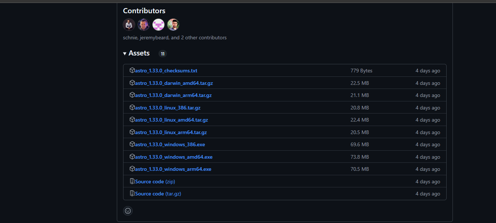
- No Windows na pasta do meu projeto:
    Exemplo: C:\Users\bruno\OneDrive\Documentos\Pessoal\livia\airflow-dbt-cloud-main\airflow-dbt-cloud-main\astro
    Criei uma nova pasta chamada "astro"
    dentro dessa pasta colei o arquivo astro.exe baixado e Copie o caminho dessa pasta.
    Exemplo: C:\Users\bruno\OneDrive\Documentos\Pessoal\livia\airflow-dbt-cloud-main\astro
    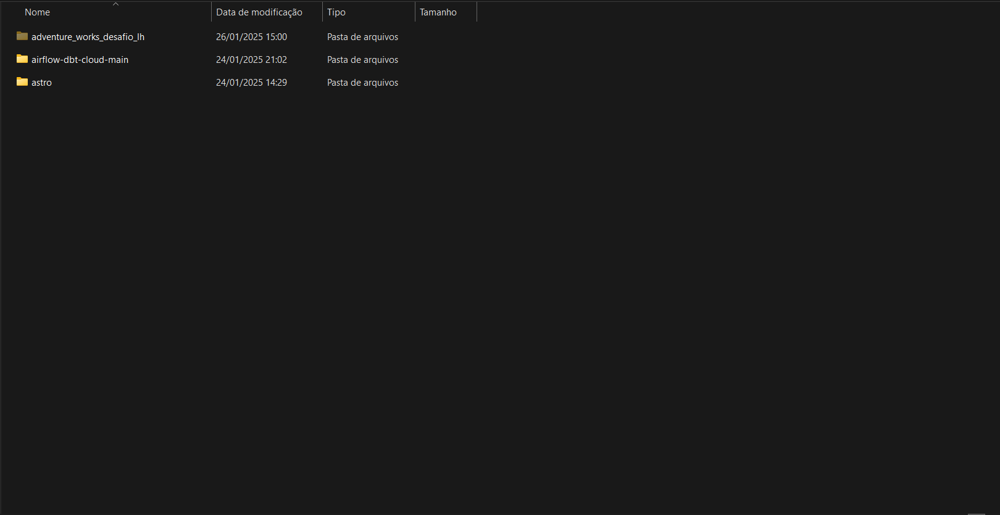

- No windows vou até o "Iniciar do Windows"
- Na aba de pesquisa "variaveis de ambiente" e abra a tela
    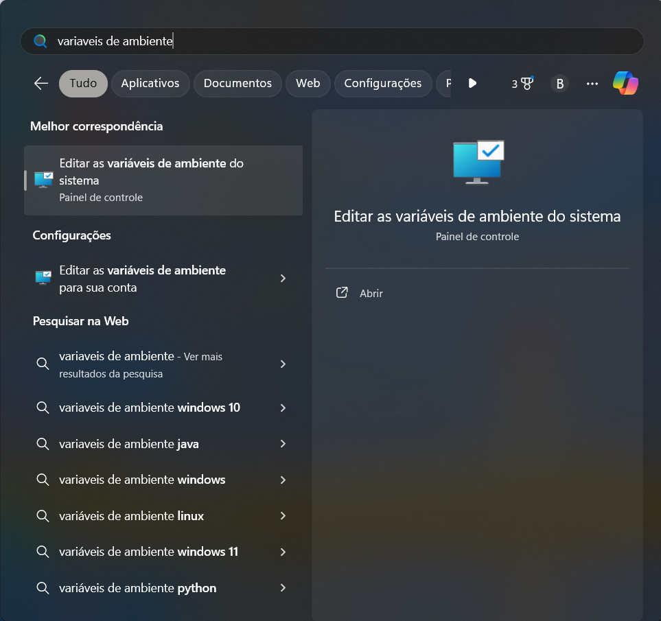
- Em Editar variaveis de ambiente, na parte de Variaveis de usuarios ou variaveis de ambientes temos a variavel no PATH, adicionar o caminho do astro. Exemplo: C:\Users\bruno\OneDrive\Documentos\Pessoal\livia\airflow-dbt-cloud-main\astro
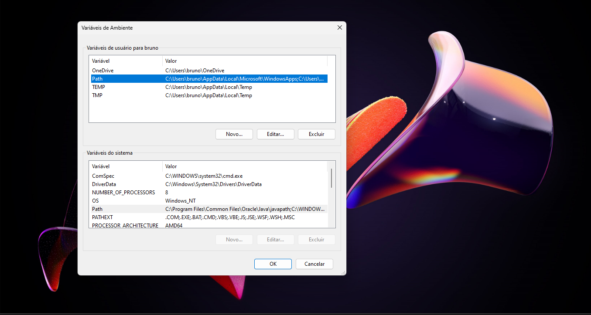
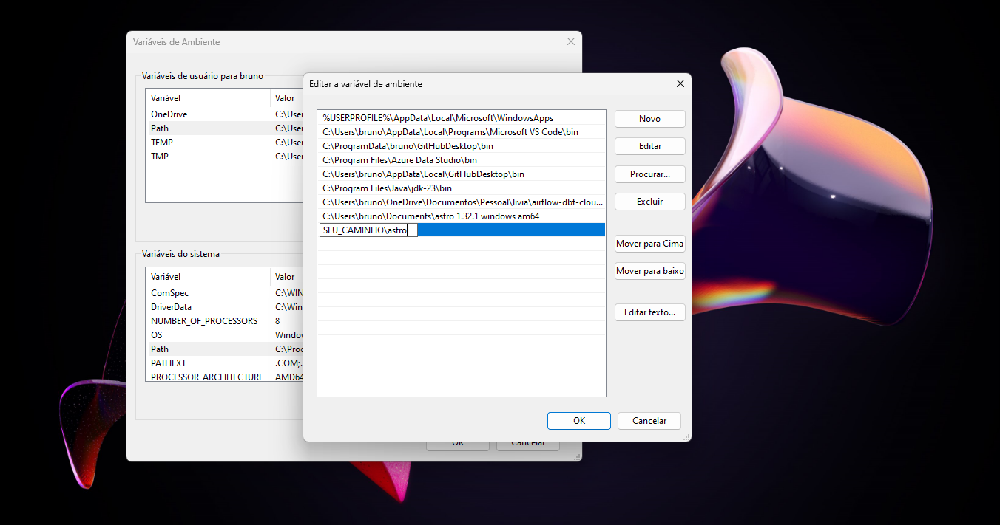
- Clique em ok e feche todas as abas relacionadas a "Editar variaveis de ambiente."
- abra o PowerShell e digite o comando ```cmd astro version```
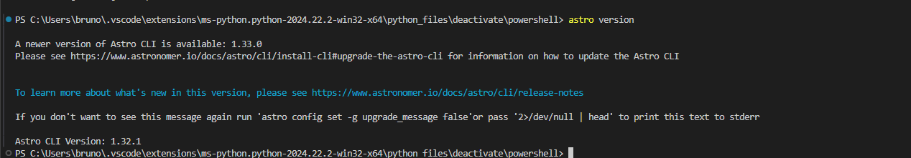
- Pronto o astro esta instalado. Caso tenha algum problema procure tutoriais no youtube ou siga o tutorial do proprio dbt pelo link do inicio desta parte do tutorial do airflow.

**2º Passo Baixar Docker (Windows)**
Link download docker: https://docs.docker.com/desktop/setup/install/windows-install/
Baixe a versão: x86_64 ou arm_64 dependendo do seu PC. Padrão: x86_64
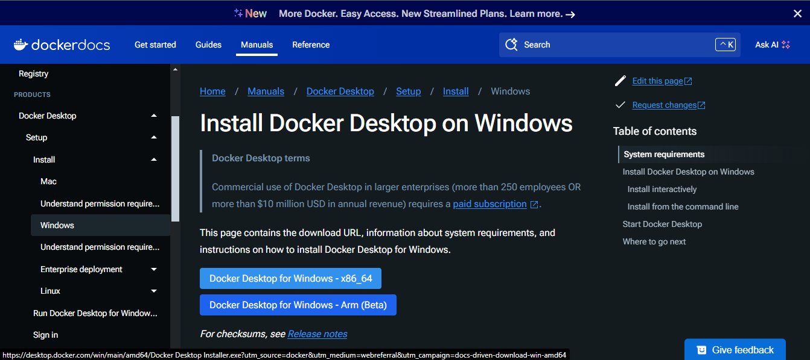
- Instale, não precisa de realizar configurações apenas a instalação normal.

**3º Passo Baixar Docker (Windows)**
    - Volte ao PowerShell e clone o repositorio do dbt cloud
    ``` git clone https://github.com/dbt-labs/airflow-dbt-cloud.git```
    *Caso não tenho chave ssh configurada baixe via Zip no site: https://github.com/dbt-labs/airflow-dbt-cloud.git
    - Entre na pasta do dbt hubairflow baixada ou clonada do github e copie os seguintes arquivos para a pasta do seu projeto.
    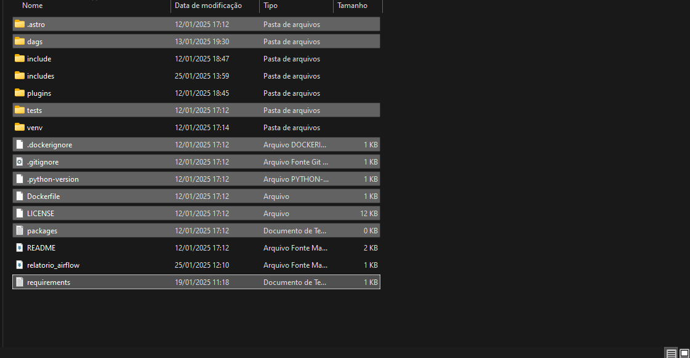
- Arquivos e pastas a serem copiados:
    - .astro 
    - dags 
    - .dockerignore
    - .python-version
    - Docekrfile
    - LICENSE
    - packges
    - requirementes.txt

- Cole os arquivos copiados na pasta do seu projeto
*ADICIONE AQUI O PRINT DOS ARQUIVOS MESCLADOS ARIFLOW E DBT ORIGINAL DA LIVIA*
- para rodar o airflow va ao PowerShell novamente e rode o comando
´´´astro dev start´´´
Este comendo realizara tudo necessário para rodar o airflow para se conectar com o dbt.
- Após finalizar a aexecução abra no navegador o site: ```http://localhost:8080```
Essas são as credenciais do airflow: 
Username: admin
Password: admin

**3º Passo Conectar DBT CLOUD ao Airflow (Windows)**
- Vá ao dbt cloud > Account Settings > Token API > Service Token
__Atenção__: É necessário que seja ums service token, o personal token não consegue rodar um ```Job```.
Caso seu tempo free tenha expirado crie uma nova conta.
__PRINT__
- Crie o service token com permissoes de ```Admin```
- Volte ao Airflow > Admin > Connections

    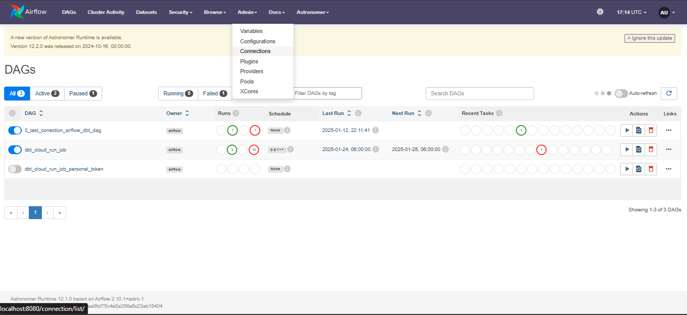

- Preencha a conexão do dbt_cloud confirme imagem abaixo:
    __Connection Id__ : è o nome da conexão que voce ira usar para chamar da DAG do dbt
    __Connection Type__ : Campo de select, selecione o dbt_cloud para criar a conexão do dbt
    __Tenant__: é a base url do seu site onde esta o seu projeto do dbt. Exemplo: getdbt.com, sem o https:// e termina no .com, .us ou algo parecido
    __Account ID__: Id da sua conta do dbt cloud.
    __API Token__: API token gerada no site do dbt cloud.
    Clique em "Save" para salvar a conexão

    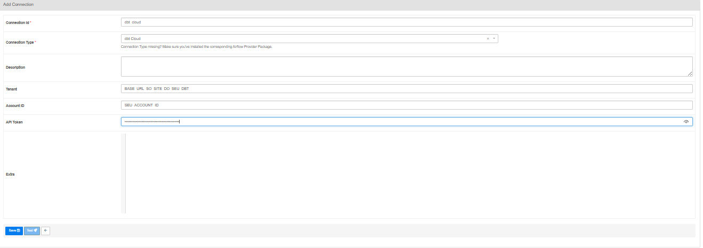
    Concluímos a criação da conexão do dbt cloud com o airflow
**4º Passo Rodar um Job com Airflow(Windows)**
- Vá ao DBT Cloud > Deploy > Enviroment 
    - Crie um ambiente de produção, clique em rodar uma branch especifica caso queriaa rodar a development se não o DBT roda a main automaticamente.
    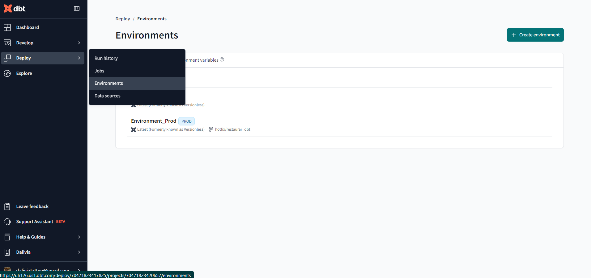
    
- Vá ao dbt cloud > Deploy > Job
    - Selecione o ambiente produtivo 
    - Coloque os comandos no ```Job```: 
        dbt test 
        dbt run
    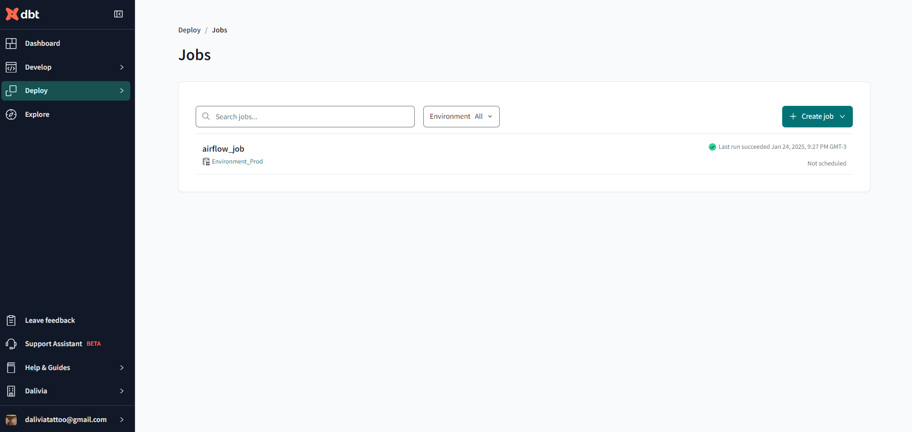

    Salve o ID do job. Na URL do site depois de ```jobs/``` temos o ID do job
    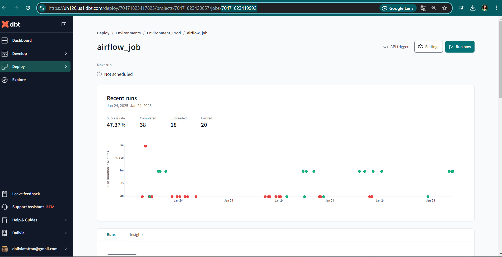
    Concluído a criação do job

**5º Passo criar DAG no Airflow(Windows)**
-  Na pasta dags do projeto criei um arquivo ```dbt_cloud_run_job`.py```
    Criei a Dag conforme codigo abaixo:
```python

from datetime import datetime

from airflow.models import DAG
from airflow.providers.dbt.cloud.operators.dbt import DbtCloudRunJobOperator

### Update these ids to match your account ###
DBT_CLOUD_CONN_ID = <NOME_DA_MINHA_CONEXAO_DBT>
ACCOUNT_ID = <ACCOUNT_ID_DAMINHA_CONTA_DBT>
JOB_ID = <JOB_ID_CRIADO_PARA_ESTE_DESAFIO>


with DAG(
    # usar conexão criada no airflow
    dag_id="dbt_cloud_run_job",
    default_args={"dbt_cloud_conn_id": DBT_CLOUD_CONN_ID, "account_id": ACCOUNT_ID},
    start_date=datetime(2021, 1, 1),
    # rodar às 6h diariamente
    schedule_interval='0 6 * * *',  
    catchup=False,
) as dag:

    trigger_dbt_cloud_job_run = DbtCloudRunJobOperator(
        task_id="trigger_dbt_cloud_job_run",
        job_id=JOB_ID,
        check_interval=10,
        timeout=300,
        retry_from_failure=True,
    )

    trigger_dbt_cloud_job_run

```
- Pronto! tenho a dag condigurada.
Agora é so rodar a dag ou esperar que rode automaticamente as 6h da manhã de cada dia.

**Prova Airflow Rodando**
- Agendado Schedule para 6h da manhã de cada dia.
    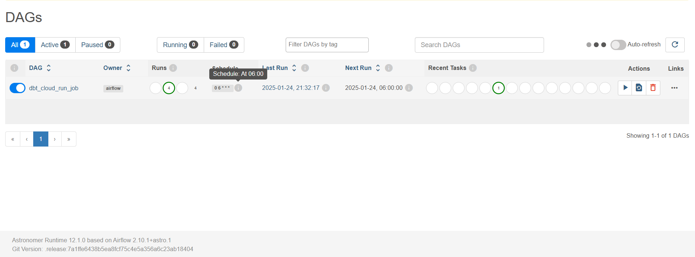
- Rodado 3 vezes consecutivas
    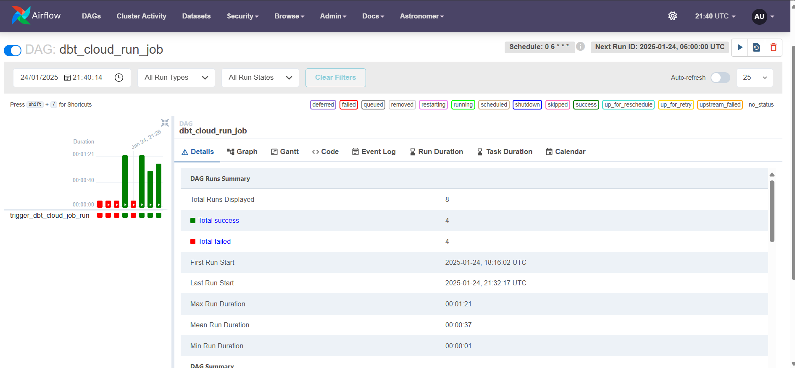
    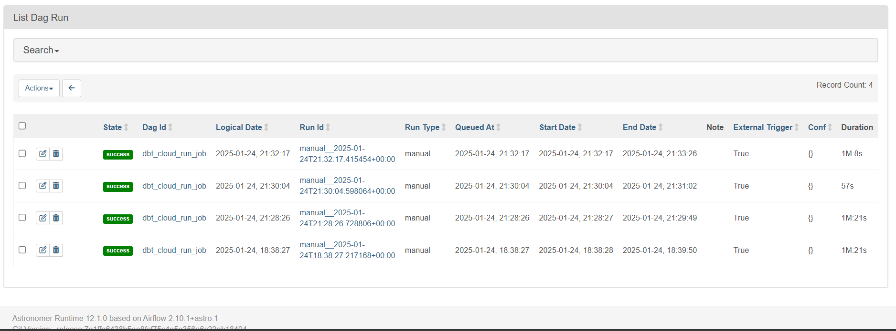
